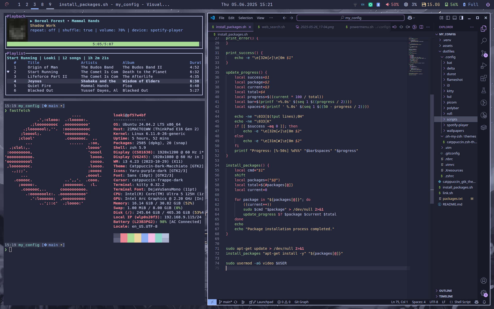

# config

| tools | |
| --- | --- |
| compositor | [picom](https://github.com/yshui/picom) |
| notification | [dunst](https://github.com/dunst-project/dunst) |
| terminal | [kitty](https://github.com/kovidgoyal/kitty) |
| shell | [zsh](https://ohmyz.sh/) |
| dmenu | [rofi](https://github.com/davatorium/rofi) |
| screenshot | [flameshot](https://github.com/flameshot-org/flameshot) |
| google drive | [google-drive-ocamlfuse](https://github.com/astrada/google-drive-ocamlfuse) |
| note | [nb](https://github.com/xwmx/nb) |
| bluetooth | [blueman](https://github.com/blueman-project/blueman) |
| passwords | [keepassxc](https://keepassxc.org) |
| browser | [firefox](https://www.mozilla.org/en-US/firefox/new/) |
| ide | [vsc](https://code.visualstudio.com/) |
| editor | [vim](https://www.vim.org/) |
| http | [httpie](https://github.com/httpie/cli) |
| audio | [pulseaudio](https://doc.ubuntu-fr.org/pulseaudio) |
| volume | [pavucontrol](https://doc.ubuntu-fr.org/pavucontrol) |
| wallpaper | [feh](https://doc.ubuntu-fr.org/feh) |
| sys info | [conky](https://doc.ubuntu-fr.org/conky) |
| display rendering | [autorandr](https://github.com/phillipberndt/autorandr) |
| json processor | [jq](https://github.com/jqlang/jq) |
| file manager | [nnn](https://github.com/jarun/nnn) |
| spotify tui | [spotify-player](https://github.com/aome510/spotify-player) |
| lazy-docker | [lazy-docker](https://github.com/katopz/lazy-docker)|
| lowfi cli | [lowfi](https://github.com/talwat/lowfi) |
| transfer files | [croc](https://github.com/schollz/croc) |
| hacker news cli | [circumflex](https://github.com/bensadeh/circumflex) |
| stackoverflow cli | [aso](https://github.com/loaki/aso) |

| themes | |
| --- | --- |
| catppuccin | [catppuccin-macchiato](https://github.com/catppuccin) |
| cursor | [Macchiato Dark](https://github.com/catppuccin/cursors) |
| GTK | [Catppuccin](https://github.com/Fausto-Korpsvart/Catppuccin-GTK-Theme) |
| font | [JetBrainsMono](https://www.jetbrains.com/lp/mono/) |
| wall | [catppuccin](https://github.com/orangci/walls-catppuccin-mocha) |
| theme switcher | [lxappearance](https://github.com/lxde/lxappearance) |

| zsh | |
| --- | --- |
| syntax | [zsh-syntax-highlighting](https://github.com/zsh-users/zsh-syntax-highlighting) |
| autosuggestions | [zsh-autosuggestions](https://github.com/zsh-users/zsh-autosuggestions) |
| fuzzy finder | [fzf](https://github.com/junegunn/fzf) |
| better cd | [zoxide](https://github.com/ajeetdsouza/zoxide) |
| better cat | [bat](https://github.com/sharkdp/bat) |
| better ls | [lsd](https://github.com/lsd-rs/lsd) |
| better diff | [delta](https://github.com/dandavison/delta) |

| kitty | |
| --- | --- |
| grab | [kitty_grab](https://github.com/yurikhan/kitty_grab) |

| i3 | |
| --- | --- |
| autotiling | [autotiling](https://github.com/nwg-piotr/autotiling) |
| i3lock color | [i3lock-color](https://github.com/Raymo111/i3lock-color) |
| bar | [polybar](https://wiki.archlinux.org/title/Polybar) |
